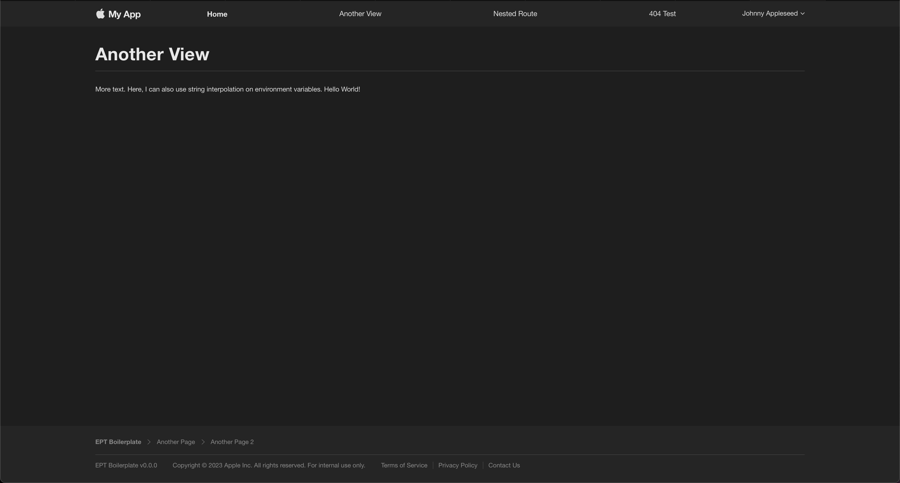

# EPT App Boilerplate

Welcome to the EPT Web App Boilerplate repository! My hope is that this project will allow you to quickly spin up a new project while keeping with the design language of all current and future EPT products.

At the moment, this is pretty bare and simple with just enough to get you started. My hope is that, as a team, we can add more as we see fit and work towards a more mature design language in the future.

## Preview



## Features

- Client-side routing (courtesy of TanStack Router)
- Dynamic light/dark mode to match client settings
- Dynamically generated breadcrumbs
- Responsive layout

## How to develop locally

1. Change app name in `package.json`
2. Copy the `.env.example` file to `.env` or `.env.development`
3. Change the app name in this `.env` file
4. Run `yarn install` or `npm install`
5. After all of the dependencies have been installed, run `yarn dev` or `npm dev`
6. In the terminal, press `o` to open the webpage, `r` to reboot the server, and `q` to quit.

## Notes

- Components, views, utils, assets, and styles can be quickly referenced by adding a `@` in front of their import path. E.g.

```TypeScript
import { router } from "@/utils/router";
import "@styles/ErrorView.css";
```

- ***PLEASE DO NOT FORGET TO REQUEST OSS APPROVAL***. Please go [here](https://compass.scv.apple.com/jira/servicedesk/customer/portal/23/create/303) to put in a reguest and edit `./docs/OSS.md` accordingly.

## Todos

- [ ] Add grid layout example
- [ ] Improve breadcrumbs process
- [ ] Fix flashing issue on route change that is only visible on Safari (Tanstack Router issue?)
- [ ] Add cool ascii art as title of readme
